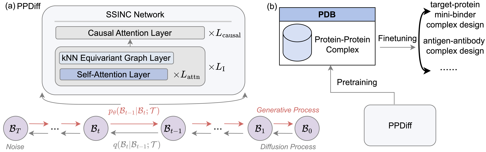

<h1>PPDiff: Diffusing in Hybrid Sequence-Structure Space for Protein-Protein Complex Design</h1>

<h2>Model Architecture</h2>

This repository contains code, data and model weights for ICML 2025 paper [PPDiff: Diffusing in Hybrid Sequence-Structure Space for Protein-Protein
Complex Design](https://arxiv.org/pdf/2506.11420)

The overall model architecture is shown below:




<h2>Environment</h2>
The dependencies can be set up using the following commands:

```ruby
conda env create -f PPDiff.yml 
conda activate PPDiff 
bash setup.sh 
```

<h2>General Protein-Protein Complex Design</h2>

<h2>Download Data</h2>

We provide our curated protein-protein complex dataset PPBench at [PPBench](https://drive.google.com/file/d/1DmvVKvZIVxT4-bxIIZ4bRQtIrQJ2QwJN/view?usp=sharing) 

Please download the dataset and put them in the data folder.

```angular2html
mkdir data 
cd data 
wget https://drive.google.com/file/d/1DmvVKvZIVxT4-bxIIZ4bRQtIrQJ2QwJN/view?usp=drive_link
wget https://drive.google.com/file/d/1LVP7j1KhmgnotB_N7WyrKY8eBU61d_Ht/view?usp=sharing
```

<h2>Download Model</h2>

We provide the checkpoint of general protein-protein complex design task used in the paper at [Model](https://drive.google.com/file/d/19SmgY7sXIPN2Wk5Rln7x9jzzJ5np-Hmj/view?usp=sharing) 


Please download the checkpoints and put them in the models/PPDiff folder.

If you want to train your own model, please follow the training guidance below

<h2>Training</h2>
If you want to train a model from scratch, please follow the script below:

```ruby
bash train_complex_data_diffusion.sh
```

<h2>Inference</h2>
To design general protein-protein complexes, please use the following scripts:

```ruby
bash generation.sh
```

There are three items in the output directory:

1. target.txt refers to the target protein sequences
2. binder.true.txt refers to the input binder sequences
3. binder.gen.txt refers to the designed binder sequences


<h2>Target Protein-Mini Binder Complex Design</h2>

<h2>Download Data</h2>

We provide our the curated target protein-mini binder complex dataset at [Binder_Design_Data](https://drive.google.com/file/d/1-SWyf7WQz0UCilXjUgAU-rPIBYT-U8ZD/view?usp=drive_link) 

Please download the dataset and put them in the data folder.

```angular2html
cd data 
wget https://drive.google.com/file/d/1-SWyf7WQz0UCilXjUgAU-rPIBYT-U8ZD/view?usp=drive_link
```

<h2>Download Model</h2>

We provide the checkpoint of the target protein-mini binder complex design task used in the paper at [Binder_Design_Model](https://drive.google.com/file/d/1Xbqvy5pVqKkTpvTJ_ISIN8TJ2JozEnxN/view?usp=drive_link) 


Please download the checkpoints and put them in the models/binder_design folder.

If you want to finetune your own model using our curated data, please follow the finetuning guidance below:

<h2>Finetuning</h2>
If you want to finetune a binder design model, please follow the script below:

```ruby
bash fineune_target_protein_mini_binder_complex.sh
```

<h2>Inference</h2>
To design target protein-mini binder complexes, please use the following scripts:

```ruby
bash generation.sh
```

There are three items in the output directory:

1. target.txt refers to the target protein sequences
2. binder.true.txt refers to the input binder sequences
3. binder.gen.txt refers to the designed binder sequences

The order of the target protein category in the test set are ["EGFR", "FGFR2", "H3", "IL7Ra", "InsulinR", "PDGFR", "TGFb", "Tie2", "TrkA", "VirB8"] with size {"EGFR": 4, "FGFR2": 57, "H3": 38, "IL7Ra": 7, "InsulinR": 23, "PDGFR": 26, "TGFb": 9, "Tie2": 2, "TrkA": 4, "VirB8": 7}. You can get the category of the designed binder by mapping the corresponding ground truth target and binder proteins.


<h2>Antigen-Antibody Complex Design</h2>

<h2>Download Data</h2>

We provide our the curated antigen-antibody complex dataset through [CDR-H1 cluster](https://drive.google.com/file/d/1a5tIcoVfY95CpKnBnewQj96xu651vev_/view?usp=drive_link), [CDR-H2 cluster](https://drive.google.com/file/d/1yvIr4dkK2xWzKYm2qHidrE8eh-VO5ab2/view?usp=drive_link), [CDR-H3 cluster](https://drive.google.com/file/d/12CAB2eXSrg-8yYfoVyFOYde8HCwzUHQT/view?usp=drive_link)

Please download the dataset and put them in the data folder.

```angular2html
cd data 
wget https://drive.google.com/file/d/1a5tIcoVfY95CpKnBnewQj96xu651vev_/view?usp=drive_link
wget https://drive.google.com/file/d/1yvIr4dkK2xWzKYm2qHidrE8eh-VO5ab2/view?usp=drive_link
wget https://drive.google.com/file/d/12CAB2eXSrg-8yYfoVyFOYde8HCwzUHQT/view?usp=drive_link
```

<h2>Download Model</h2>

We provide the checkpoint of the antigen-antibody complex design task obtained by training data according to [CDR-H1 cluster](https://drive.google.com/file/d/1CCmbkBChZeoJp4uXAm-Zyjk9iMKupDWf/view?usp=drive_link), [CDR-H2 cluster](https://drive.google.com/file/d/1Owoo6t7g5VSavP5AVhmzeSC7_vefcWYx/view?usp=drive_link), [CDR-H3 cluster](https://drive.google.com/file/d/1nyL_bEQrUXg8QBcSOj8xEtlCSMb_oFF3/view?usp=drive_link)


Please download the checkpoints and put them in the models/antibody_design_cdrh1, models/antibody_design_cdrh2, models/antibody_design_cdrh3 folder.

If you want to finetune your own model using our curated data, please follow the finetuning guidance below. Here we taking data by CDR-H1 clustering as an example:

<h2>Finetuning</h2>
If you want to finetune an antibody design model, please follow the script below:

```ruby
bash finetune_antigen_antibody_complex_design_cdrh1.sh
```

<h2>Inference</h2>
To design antigen-antibody complexes, please use the following scripts:

```ruby
bash design_antibody.sh
```

There are three items in the output directory:

1. antigen.true.txt refers to the antigen sequences
2. heavy.chain.true.txt refers to the ground truth heavy chain sequences
3. heavy.chain.gen.txt refers to the designed heavy chain sequences
4. light.chain.true.txt refers to the ground truth light chain sequences
5. light.chain.gen.txt refers to the designed light chain sequences


<h2>Citation</h2>
If you find our work helpful, please consider citing our paper.

```
@article{song2025ppdiff,
  title={PPDiff: Diffusing in Hybrid Sequence-Structure Space for Protein-Protein Complex Design},
  author={Song, Zhenqiao and Li, Tiaoxiao and Li, Lei and Min, Martin Renqiang},
  journal={arXiv preprint arXiv:2506.11420},
  year={2025}
}
```
